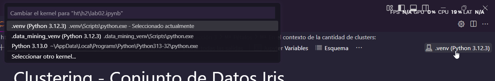

# Clustering 📊

Se aplicó el método de agrupación **K-Means Clustering** en el conjunto de datos **Iris**, que contiene medidas de sépalo y pétalo de tres especies de flores (*Iris setosa, Iris virginica e Iris versicolor*); para identificar patrones en los datos, probando diferentes números de clusters y comparando los resultados con las especies reales. Además, se utilizó el **método del codo** y la librería **kneed** para determinar el número óptimo de clusters. Finalmente, se analizaron las diferencias entre la agrupación basada en sépalo y pétalo, evaluando su efectividad en la clasificación de las flores.

## 🐍 Entorno

**Lenguaje**: Python

**Versión**: 3.12.3

## 📂 Archivos principales

## 🔄 Repetir el proceso

1. **Clonar respositorio y cambiar de rama**:

   - Clona el repositorio usando el siguiente comando:

      ```bash
      git clone https://github.com/JosueSay/Data_Mining.git
      ```

2. **Crear un entorno virtual**:

   - Crear un entorno virtual y activalo. Usa el siguiente comando:

      **PowerShell**

      ```bash
      python -m venv .venv
      cd .venv/Scripts
      Activate.ps1
      cd ../..
      ```

      **WSL/Linux**

      ```bash
      python -m venv .venv
      source .venv/bin/activate
      ```

   - Puedes omitir este paso si deseas instalar las dependencias en tu máquina.

3. **Instalar las dependencias**:
   - Instala las dependencias necesarias desde la raiz del repositorio:

     ```bash
     pip install -r .\ht\h2\requirements.txt
     ```

     Esto instalará todas las librerías necesarias.

4. **Configurar el entorno en Jupyter**:

   - En el kernel de Jupyter Notebook selecciona el entorno virtual creado; si instalaste las librerias fuera de un entorno selecciona el interprete de python utilizado.

      

5. **Ejecutar el script**:
   - Corre las instrucciones de `lab02.ipynb` para replicar el proceso de limpieza y transformación de datos si usas la extensión de `jupyter notebook` en vscode de lo contrario puedes ubicarte en la raiz de la carpeta y ejecutar el siguiente comando:

      ```bash
      jupyter notebook .\ht\h2\lab02.ipynb
      ```

## 🤔 ¿Qué se hizo?

Se realizaron análisis de clustering utilizando K-Means en diferentes características del conjunto de datos de iris:

- Se visualizaron los datos y se exploró la agrupación con la forma del sépalo.
- Se aplicó K-Means con 2 clusters y luego con datos estandarizados para comparar resultados.
- Se utilizó el método del "codo" para determinar el número óptimo de clusters.
- Se probaron diferentes números de clusters y se compararon con los datos reales.
- Se repitió el proceso con la forma del pétalo para evaluar diferencias.
- Se utilizó la librería "kneed" para validar los resultados obtenidos con el método del "codo" y se compararon con los datos reales.
- Se analizaron las conclusiones basadas en los resultados obtenidos.

## 🎥 Demostración

- [**Video Demostrativo de Ejecución del Programa**](https://youtu.be/jiafnJTo8Uo)
