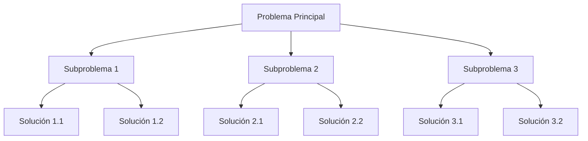
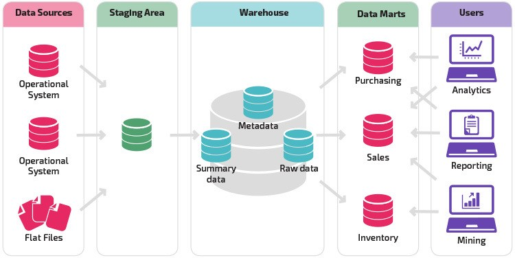

# Minería de Datos 🛠️

La minería de datos es el proceso de analizar grandes volúmenes de información para descubrir patrones, tendencias y conocimientos útiles. Este proceso se centra en extraer valor a partir de datos mediante diversas técnicas y enfoques.

## Perspectivas en la Minería de Datos 🔍

Existen cuatro perspectivas clave en la minería de datos que están interrelacionadas:

1. **Los datos mismos**: Tipos y características de los datos.
2. **Aplicaciones**: Sectores y usos específicos de los datos.
3. **Conocimiento**: Patrones y hallazgos derivados de los datos.
4. **Técnicas**: Métodos y herramientas para trabajar con los datos.

### Vista de los Datos 📊

Los datos pueden ser evaluados a través de las siguientes características, conocidas como las 5Vs:

- **Volumen**: Cantidad de datos disponibles.
- **Variedad**: Diversidad de formatos (estructurados, no estructurados, etc.).
- **Velocidad**: Ritmo al que se generan y procesan los datos.
- **Veracidad**: Calidad y confiabilidad de los datos.
- **Valor**: Utilidad o relevancia de los datos para la toma de decisiones.

#### Tipos de Datos

1. **Relacionales y transaccionales**:

   - Ejemplos: Registros de estudiantes, historial de compras.

2. **Secuenciales y temporales**:

   - Ejemplo: Datos de series de tiempo como lecturas de sensores o tendencias de redes sociales.

3. **Espaciales**:

   - Ejemplo: Información geográfica y mapas.

4. **Textuales, multimedia y web**:

   - Ejemplo: Comentarios en redes sociales, imágenes, videos.

5. **Grafos y redes**:

   - Ejemplo: Redes sociales, conexiones en un sistema de transporte.

Los datos pueden combinar estas características, formando conjuntos complejos.

### Vista de las Aplicaciones 🏭

La minería de datos se aplica en diversos sectores, como:

- **Análisis de mercado**: Identificación de tendencias y comportamientos de consumo.
- **Salud**: Descubrimiento de patrones en datos clínicos y genómicos.
- **Ciencia**: Análisis de datos experimentales y simulaciones.
- **Educación**: Seguimiento del progreso estudiantil y personalización del aprendizaje.

### Vista del Conocimiento 🧠

Esta perspectiva analiza qué información se puede extraer de los datos:

- **Patrones frecuentes**: ¿Qué combinaciones aparecen con regularidad?
- **Categorías**: Clasificación de los datos en grupos significativos.
- **Anomalías**: Identificación de valores atípicos o inusuales.
- **Evolución temporal**: Cambios en los datos a lo largo del tiempo.

### Vista de las Técnicas 🛠️

Las técnicas empleadas dependen del tipo de conocimiento que se busca extraer. Ejemplos:

- **Análisis de patrones**: Descubrimiento de secuencias o asociaciones frecuentes.
- **Clasificación**: Asignar categorías predefinidas a los datos.
- **Agrupamiento (Clustering)**: Identificar grupos naturales en los datos.
- **Detección de anomalías**: Encontrar datos que no siguen el patrón general.

#### Ejemplo Visual: Técnica "Divide y vencerás"

```markdown
1. Dividir: Separar un problema complejo en subproblemas más pequeños.
2. Resolver: Abordar cada subproblema de forma independiente.
3. Combinar: Integrar las soluciones parciales para resolver el problema completo.
```



---

### Recursos adicionales

**Clustering:** El clustering es un algoritmo de machine learning no supervisado que organiza y clasifica diferentes objetos, puntos de datos u observaciones en grupos o clusters basados en similitudes o patrones.

## Flujo de la Minería de Datos 🔄

### 1. Entendimiento de Datos

Los datos pueden estar en diversas formas, como archivos Excel, resúmenes, etc. La forma de los datos influye en su relevancia y uso. Es fundamental enfocarse en el análisis en sí y no en la cantidad de datos disponibles.

**Fases iniciales:**

- Identificar qué datos se tienen y su naturaleza.
- Extraer estadísticas y visualizar datos.
- Detectar similitudes, disimilitudes, patrones generales y anomalías.

Este enfoque permite descubrir resultados inesperados o previamente desconocidos.

### 2. Procesamiento de Datos 🔧

**Cuestiones clave:**

- ¿Hay datos faltantes, errores o inconsistencias?
- Preparación de los datos mediante:
  - Limpieza.
  - Integración.
  - Transformación.
  - Reducción (en caso de exceso de datos).

> **Nota:** Sin datos de calidad, no hay minería de datos.

### Almacenamiento de Datos (Data Warehousing) 🗄️



El almacenamiento debe estar diseñado para servir eficazmente en las fases finales, con el objetivo de mejorar las condiciones humanas.

### 3. Modelación de Datos 📈

Métodos comunes:

- **Análisis de patrones frecuentes**.
- **Clasificación y predicción**.
- Herramientas como árboles de decisión, redes neuronales y clustering.

### 4. Evaluación de Patrones ✅

Identificación de patrones interesantes en los datos:

- Nuevos.
- Válidos.
- Generalizables.
- Útiles y explicables.

**Aspectos a considerar:**

- Comparar modelos, incluso si tienen predicciones bajas (por ejemplo, uno con 50% vs. uno con 10%).
- Métricas de evaluación: exactitud, tasa de error, tasa de falso positivo, eficiencia, latencia.
- Selección del modelo más adecuado.

#### Métodos de Aprendizaje

- **Supervisado**: El modelo aprende con ejemplos y respuestas.
- **No supervisado**: El modelo identifica patrones sin ejemplos específicos.

> **Nota:** El objetivo es lograr un razonamiento analítico efectivo.

### Desafíos

- Calidad de datos: Problemas de estandarización en la medición.
- Minería incremental e interactiva.
- Colaboración con expertos en el dominio.
- Analítica visual mediante gráficos.

### 5. Ética de Datos ⚖️

- Propiedad y privacidad de los datos.
- Anonimato.
- Validez de los datos y modelos: ¿Son reales los datos?
- Sesgos en datos y modelos: Evitar falta de generalidad.
- Interpretación y aplicación responsable.
- Consecuencias sociales.

Más información en [ACM SIGKDD](https://www.kdd.org).

---

## Revisión General de Estadísticas 📊

### Tipos de Datos

1. **Numéricos**:
   - **Discretos**: Se pueden contar (ejemplo: número de hijos).
   - **Continuos**: No se pueden contar (ejemplo: peso, altura).
   - Representaciones: Histogramas, histogramas de frecuencia relativa, tablas de frecuencia.

2. **No numéricos (categóricos)**:
   - Representaciones: Gráficas de barra, gráficos de pastel, gráficos de Pareto, tablas de distribución de frecuencia.

### Niveles de Medición

1. **Cualitativos**:
   - **Nominales**: Sin orden (ejemplo: colores).
   - **Ordinales**: Tienen un orden (ejemplo: niveles educativos).

2. **Cuantitativos**:
   - **Intervalos**: No tienen un cero absoluto (ejemplo: temperatura en °C).
   - **Racionales**: Tienen un cero absoluto (ejemplo: peso).

### Herramientas y Métricas

- **Tablas cruzadas** o de contingencia.
- **Gráficos de dispersión (scatterplots)**.
- Medidas de tendencia central:
  - **Mediana**: No afectada por datos atípicos.
  - **Moda**.
  - **Media**: Afectada por datos atípicos.
- **Asimetría u oblicuidad**: Determina si la distribución normal está desplazada.
- **Covarianza y correlación**.
- **Desviación estándar**.

---
