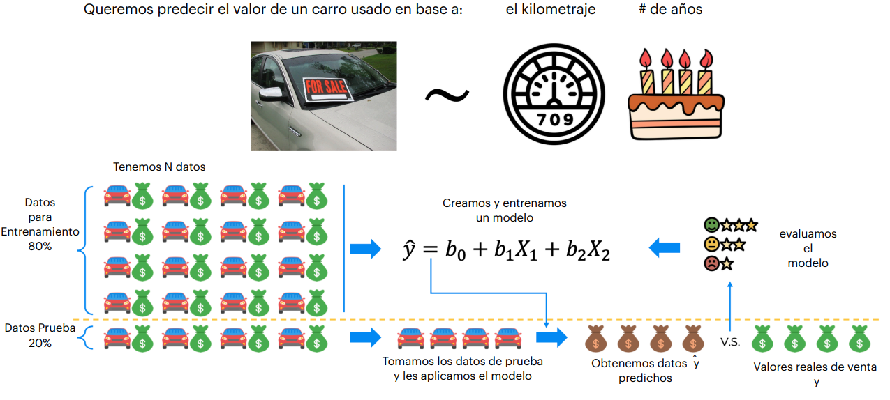
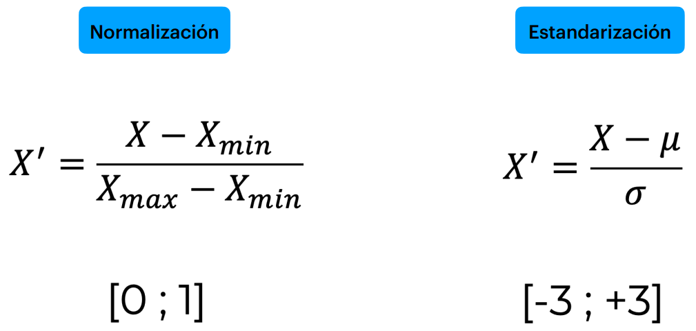

# Proceso de Machine Learning (ML) 🤖

## Preprocesamiento de Datos 🧹

1. **Obtener los datos**:
   - Este paso no es trivial; se requiere ser un investigador con acceso a fuentes adecuadas. Por ejemplo, datos de Guatemala disponibles en la Universidad de Texas.
2. **Limpiar los datos**:
   - Eliminar errores, datos duplicados, o valores inconsistentes.
3. **División entrenamiento/prueba**:
   - Separar los datos en dos conjuntos: uno para entrenar los modelos y otro para probarlos.
   - Problema común: el sobreentrenamiento (overfitting), donde el modelo funciona bien con los datos de entrenamiento, pero falla con datos nuevos.
4. **Escalamiento de características**:
   - Normalizar o estandarizar las variables para evitar que valores pequeños o grandes influyan desproporcionadamente en el modelo.

## Modelación 🛠️

1. **Construir el modelo**:
   - Utilizar modelos existentes y ajustar los parámetros según los datos específicos.
2. **Entrenar el modelo**:
   - Alimentar los datos de entrenamiento al modelo.
3. **Hacer predicciones**:
   - Aplicar el modelo entrenado para predecir resultados con datos nuevos.

## Evaluación 📊

1. **Calcular métricas del rendimiento**:
   - Utilizar métricas como exactitud, precisión, o recall según el caso.
2. **Emitir un veredicto**:
   - Determinar si el modelo cumple con los requisitos esperados.

## Conjunto de Entrenamiento y Prueba 🧪

La validación final puede fallar por varias razones, como:

- Problemas en la toma de datos.
- Errores durante la limpieza.
- Insuficiente cantidad de datos usados para el entrenamiento.

## Escalamiento de Características 📏

El escalamiento por columna es crucial para evitar volatilidad en el modelo. Valores extremos (muy grandes o pequeños) pueden distorsionar los resultados.

### Ejemplo

Se comparan salarios y edades entre tres individuos representados por colores:

| Color   | Salario  | Edad |
|---------|----------|------|
| Azul    | 70,000   | 45   |
| Morado  | 60,000   | 44   |
| Rojo    | 52,000   | 40   |

**Estandarización de los datos:**

| Color   | Salario | Edad |
|---------|---------|------|
| Azul    | 1       | 1    |
| Morado  | 0.444   | 0.75 |
| Rojo    | 0       | 0    |

Tras la estandarización, se observa que **el más parecido al Morado es el Azul**, ya que:

- En salario, ambos están casi iguales.
- En edad, el Azul está más cerca del Morado que el Rojo.

## Clustering 🧩

### Conceptos Básicos

- **Observaciones**: Registros, es decir, las mediciones.
- **Características**: Columnas o variables.

El clustering, desde un enfoque estadístico, agrupa observaciones basadas en las variables que las describen, es decir, sus características.

A diferencia de la clasificación o regresión (donde el modelo se entrena con datos conocidos), el clustering pertenece al **aprendizaje no supervisado**, ya que el modelo identifica los grupos sin intervención directa.

### Ejemplo de Clusters

Si agrupamos países como Canadá, Estados Unidos, Francia, Reino Unido, Alemania y Australia en tres clusters:

- **C1**: Canadá, Estados Unidos.
- **C2**: Alemania, Reino Unido, Francia.
- **C3**: Australia.

Este agrupamiento podría basarse en continentes.

En otro caso, agrupándolos en dos clusters:

- **C1**: Canadá, Estados Unidos, Reino Unido, Australia.
- **C2**: Alemania, Francia.

Aquí podríamos interpretarlo como países de habla inglesa y no inglesa.

Cuando usamos una sola variable, el clustering es sencillo, pero al incorporar múltiples variables (multivariables), podemos obtener **insights** más profundos.

### Objetivo del Clustering

- **Maximizar la similitud** entre los elementos dentro de un cluster.
- **Minimizar la disimilitud** entre los clusters.

---

## Diferencias entre Clustering y Clasificación 📊

- **Clustering**: Aprendizaje no supervisado. Los datos proporcionan salidas que nosotros interpretamos, sin conocer previamente el número exacto de grupos ni su utilidad.
- **Clasificación**: Aprendizaje supervisado. Se entrena el modelo con ejemplos etiquetados.

### Aplicaciones del Clustering

- **Segmentación de mercados**:
  - Identificar clientes para nuevos productos.
  - Determinar ubicaciones ideales para tiendas.
- **Segmentación de imágenes**.
- Análisis en diversas áreas como biología, geografía, y más.

---

## Análisis de Grupos (Clusters) 🔍

Pasos principales:

1. Identificar **problemas de agrupamiento**.
2. Realizar análisis de grupos.
3. Determinar el **número óptimo de grupos**.
4. Identificar las **características apropiadas** (eliminar columnas innecesarias que confundan el modelo).
5. **Interpretar los resultados**.

### K-Means Clustering

El método más conocido es **K-Means Clustering**:

- **K**: Número de grupos deseados.
- **Means**: Media utilizada para encontrar los centroides.

#### Algoritmo K-Means

1. Especificar el valor de **K**.
2. Seleccionar semillas iniciales (centroides) al azar.
3. Repetir:
   - Asignar cada punto al centroide más cercano.
   - Calcular los nuevos centroides.
4. Finalizar cuando las posiciones de los centroides no cambien.

**Nota**: Se utilizan distancias (por ejemplo, la fórmula de Pitágoras) para determinar las cercanías en un espacio con múltiples dimensiones (características).

---

## Método del Codo para Determinar el Número de Clusters 💡

Se utiliza el **WCSS (Within-Cluster Sum of Squares)**:

1. Graficar WCSS contra el número de clusters.
2. Identificar visualmente el punto donde la reducción del WCSS comienza a ser marginal ("el codo").

Esto ayuda a encontrar una cantidad óptima de clusters para que el modelo sea eficiente sin sobredimensionar.

---

## Ventajas y Desventajas de K-Means

### Ventajas ✅

- Fácil de comprender e implementar.
- Rápido en agrupar.
- Ampliamente disponible.
- Siempre produce un resultado.

### Desventajas ❌

1. **Elegir el valor de K**:
   - Puede ser subjetivo; el método del codo ayuda a mitigarlo.
2. **Sensibilidad a la inicialización**:
   - La posición inicial de los centroides afecta los resultados. Solución: usar K-Means++.
3. **Sensibilidad a valores atípicos**:
   - Solución: eliminar valores atípicos, ya que el cálculo se basa en la media y no en la mediana.
4. **Resultados esféricos**:
   - Estandarizar los datos puede ser necesario para evitar clusters distorsionados.

---

## Estandarización y Normalización 🌐

Estandarizar balancea el peso de las características para evitar que valores grandes (e.g., precios) dominen al modelo.

Ejemplo:

- **Precio**: Millones.
- **Área**: Miles.

Sin estandarizar, los valores grandes de precio pueden causar distorsiones.

Sin embargo, en ciertos casos, no estandarizar es deseable si algunas características tienen mayor peso o relevancia (e.g., precio en terrenos).

### Sesgo de Variables Omitidas (OVB)

Omitir variables importantes, intencionalmente o no, puede generar resultados sesgados. Incorporar más características o aplicar clustering puede ayudar a detectar estos problemas y mejorar la interpretación de los datos.
