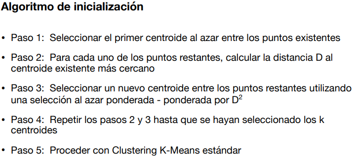
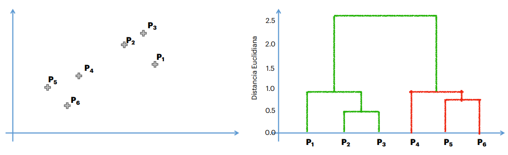
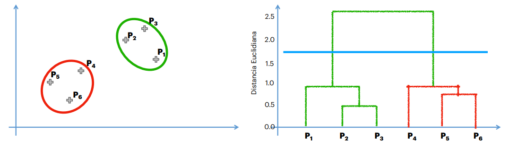

# Otras Herramientas

## K Means ++

Como vimos en el k-means, puede darnos una trampa de inicialización al azar cuando tenemos diferentes resultados.

El siguiente algoritmo identifica dónde poner los centroides:

Básicamente, se coloca el primer centroide al azar y, en la distancia más grande donde esté el dato, ahí se coloca el segundo centroide. Luego, para cada uno de estos, se colocan los nuevos centroides en caso de que k > 2. Esto se hace para tener en cuenta el objetivo del k-means normal.

Después de este algoritmo, se ejecuta el algoritmo de k-means normal.

> **Nota:** Este método no garantiza la mejor solución, porque el primer centroide sigue siendo al azar. Sin embargo, evita la trampa de inicialización al azar al ponderar dónde se coloca el siguiente centroide.

## Clustering por Jerarquía (HC)

Al igual que k-means, agrupa datos en clusters pero con una metodología diferente.

### Cluster Aglomerativo

Este método comienza con grupos sueltos y arma clusters progresivamente.

**Algoritmo:**

1. Se inicia considerando que cada dato es un cluster.
2. Se toman los dos puntos más cercanos y se agrupan en un solo cluster.
3. Se repite el paso 2 hasta que quede un solo cluster.

**¿Cómo determinar la distancia entre clusters?**

- Puntos más cercanos
- Puntos más lejanos
- Distancia promedio
- Distancia entre centroides

**¿Cuál usar?**

Depende de los datos y del criterio de un experto, ya que la distancia no siempre representa una distancia física, sino que puede llamarse mejor **disimilaridad**. Por ejemplo, en el caso de dinero vs. área de terrenos, la "distancia" entre puntos no siempre significa proximidad en un espacio físico.

### Dendrogramas

Un dendrograma es una representación visual del proceso de agrupamiento jerárquico.

Este dendrograma permite colocar un límite o **threshold** sobre la distancia euclidiana (disimilaridad), con ayuda de un experto en el tema.

Si se establece un umbral de distancia de 1.7, lo que está por encima de ese valor ya no interesa; solo se consideran los clusters que están por debajo.

### ¿Cómo determinar el umbral óptimo?

Se debe buscar la línea vertical más grande que no cruce líneas horizontales (extendidas) y hacer el corte en ese punto.

> **Nota:** Cuando se realiza una agrupación basada en variables como idioma o región y el resultado es similar en ambos casos, puede deberse a un problema de escalamiento de datos que está sesgando la agrupación hacia una de las variables.
>
> Nota preguntar la siguiente clase sobre una variable que parece entera pero en realidad es una categorica. Esto se refiere a la categorización de clusters, parece ser un número pero reflejan datos categóricos.
