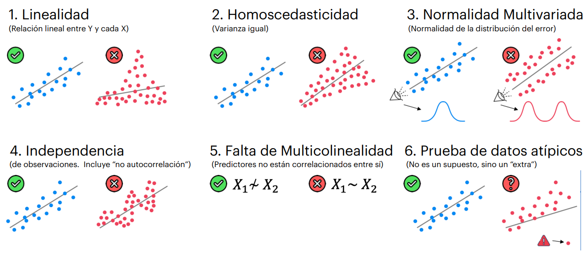
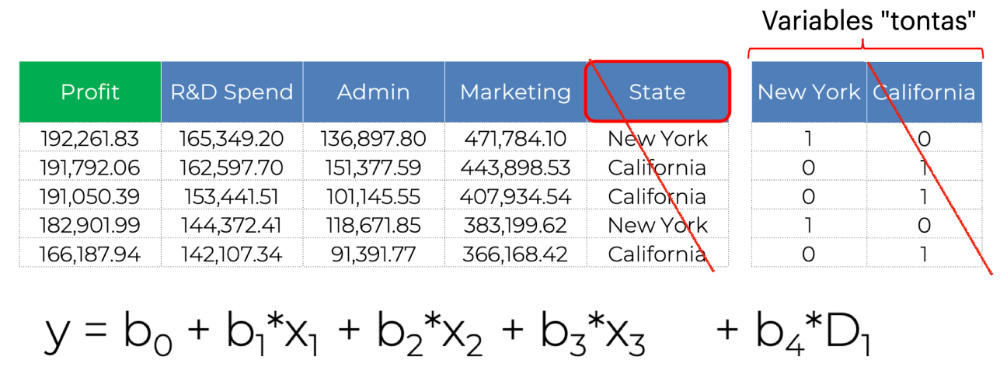
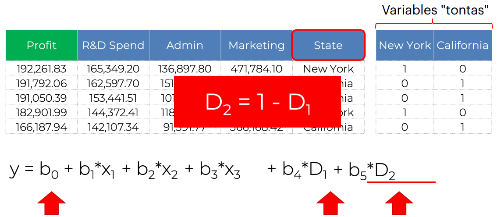
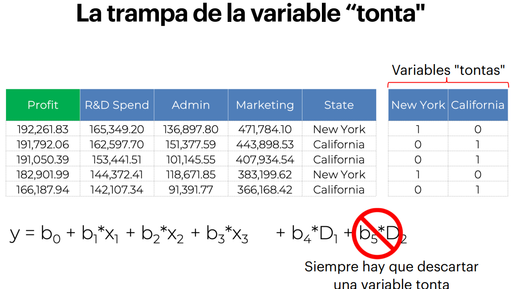
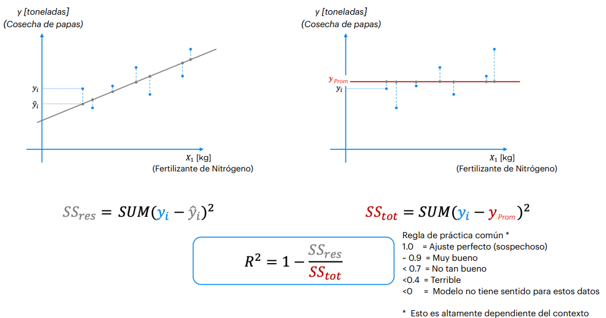
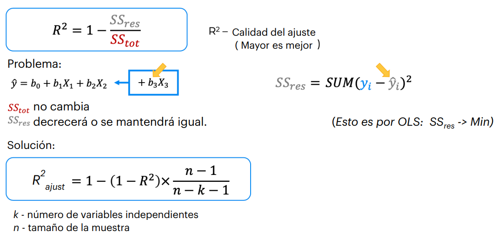

# Modelos Supervisados

## Clasificaciones

En este tipo de modelos, los datos pertenecen a un grupo específico con una variable objetivo categórica.

## Regresiones

También tratan de predecir valores, pero sin distinción de clases. Por ejemplo, el salario es un valor continuo que puede tomar cualquier valor desde 0 hasta infinito, por lo que no se puede clasificar.

### Regresión Lineal Simple

Ejemplo: eficiencia de cantidad de papas de acuerdo con la cantidad de fertilizante.

- **Fertilizante** -> Variable independiente
- **Cantidad de papas** -> Variable dependiente

Se puede observar una pendiente, donde cada incremento en la cantidad de fertilizante representa una cantidad específica de papas producidas.

Ahora, la pregunta es: **¿Qué tan buena es esa recta?** Existen diferentes formas de ajustarla, por lo que es necesario un criterio para medir su calidad.

Se utiliza **OLS (Mínimos Cuadrados Ordinarios)**, que evalúa qué tan bien la recta ajustada representa los datos observados. Se calcula la diferencia entre cada punto real y su correspondiente valor en la recta, sumando estas diferencias para encontrar la recta con el menor error posible.

### Regresión Lineal Múltiple

La fórmula lineal contiene más variables independientes. En este caso, se deben cumplir ciertos **supuestos** para que la regresión sea válida:

1. **Linealidad**: Debe existir una relación lineal entre las variables independientes y la variable dependiente.
2. **Homoscedasticidad**: La varianza de los residuos debe ser constante a lo largo de la regresión.
3. **Normalidad Multivariada**: Las variables deben seguir una distribución normal.
4. **Independencia**: No debe haber patrones en los residuos (no autocorrelación).
5. **Falta de Multicolinealidad**: Las variables independientes no deben estar correlacionadas entre sí.
6. **Prueba de Datos Atípicos**: Evaluar cómo los valores atípicos afectan el modelo.

#### Variables Dummies

Cuando las variables no son numéricas, se codifican como **variables dummies**, eliminando una de ellas para evitar colinealidad.

### Valor P

Es fundamental para determinar la **significancia estadística** de los resultados. Si el valor P es menor que un umbral predefinido (por ejemplo, 0.05), se puede concluir que la relación observada no es producto del azar.

Ejemplo de una moneda justa vs. una con dos caras:

| Iteración | Resultado | Probabilidad |
|-----------|-----------|--------------|
| 1         | Cara      | 0.5          |
| 2         | Cara      | 0.25         |
| 3         | Cara      | 0.125        |
| 4         | Cara      | 0.0625       |
| 5         | Cara      | 0.03125      |
| 6         | Cara      | 0.015625     |

Si el valor P obtenido cae por debajo del nivel de significancia establecido, se puede rechazar la hipótesis nula de que la moneda es justa.

### R Cuadrado (Coeficiente de Determinación)

Mide qué proporción de la variabilidad en los datos es explicada por el modelo. Sin embargo, **un valor de R² cercano a 1 puede indicar sobreajuste**.

Para evitar el sobreajuste, se utiliza **R² Ajustado**, que penaliza el uso de demasiadas variables en el modelo.

## Construcción del Modelo

Es importante reducir el número de variables innecesarias para mejorar el rendimiento del modelo. Existen varios métodos:

### 1. Eliminación Hacia Atrás

1. Seleccionar un nivel de significancia (ejemplo: 0.05).
2. Ajustar el modelo con todas las variables.
3. Eliminar la variable con el valor P más alto si supera el umbral.
4. Repetir hasta que todas las variables sean significativas.

### 2. Selección Hacia Adelante

1. Seleccionar un nivel de significancia.
2. Evaluar cada variable de forma individual y elegir la más significativa.
3. Agregar nuevas variables al modelo, siempre que mejoren el ajuste.
4. Detenerse cuando ninguna nueva variable sea significativa.

### 3. Eliminación Bidireccional

Es una combinación de los dos métodos anteriores, considerando tanto la entrada como la permanencia de variables en el modelo.

### 4. Comparación de Modelos

1. Evaluar todas las combinaciones posibles de variables.
2. Seleccionar el modelo con el mejor criterio de ajuste (ejemplo: Akaike).

> **Nota:** No es recomendable para grandes cantidades de variables debido a la complejidad exponencial.

El método más utilizado en la práctica es la **Eliminación Hacia Atrás**, ya que es simple y efectivo.
